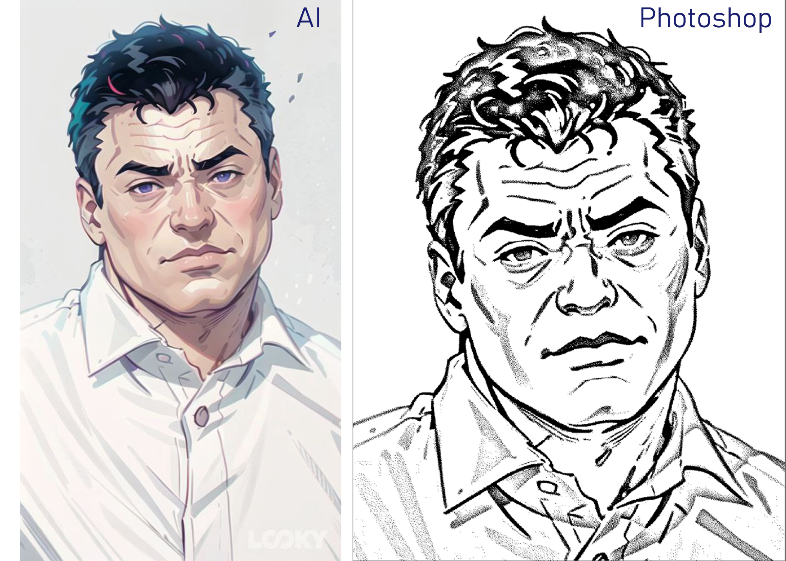

# hall-of-fame
Teamwork to create an honor board for Fablab Moscow students

## Портрет

Формат портретов были выбран исходя из концепции акрилового ночника. На лист оргстекла с помощью лазерного станка наносится гравировка стилизованного
изображения (стиль своего портрета может выбрать сам студент), сгенерированного нейросетью. Опытным путем была выбрана нейросеть мобильного приложения [LOOKY](https://www.looky.com/). Портрет вставляется в раму с установленной в ней светодиодной лентой.

Для лазерной гравировки портрет проходит 2 этапа подготовки:

1) Генерация изображения в нейросети
2) Обработка и перевод в битовый формат в программе Adobe Photoshop

Рисунок 1 - Обработанный портрет для печати

Рисунок 2 - Готовые портреты на акриле (лазерная гравировка)

## Разработка и производство рамы

**Процесс фрезеровки деталей рамы**

https://github.com/gitzense/hall-of-fame/assets/144244924/b9aa5b27-b511-481d-8bcd-a101cb178d42

Рисунок Х - Рама и портрет в собранном виде

## Подсветка

Светодиодная лента размещается в раме у основания портрета.

Рисунок Х - Конструкция подсветки 

## CAD

Верх и низ рамки

Правая и левая часть рамки

